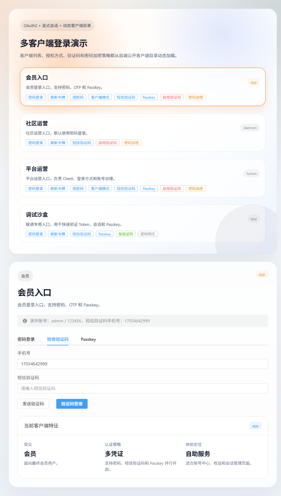
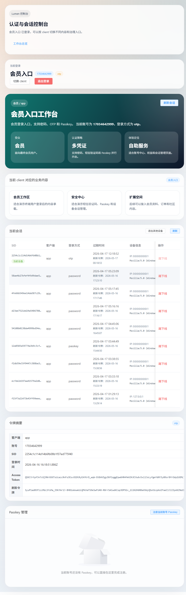
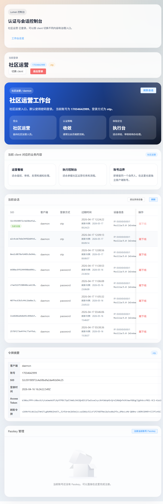
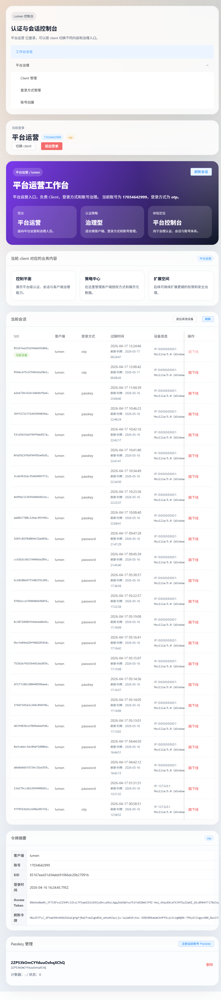
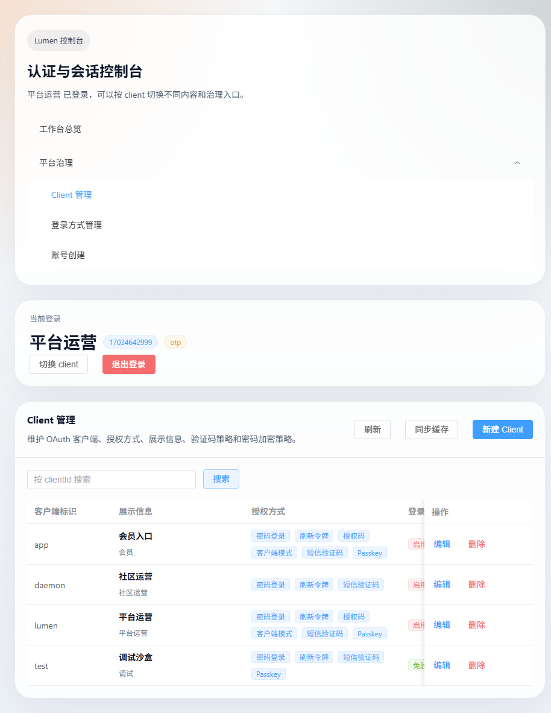

# LUMEN

## 项目介绍

LUMEN 当前是一个围绕认证、授权、账号治理、凭证治理和会话治理构建的单体系统。

当前交付重点是：

- 支持 `1..N` 个登录入口，而不是只写死 3 个入口
- 支持多维凭证：`password / otp / passkey`
- 支持多设备在线和显式会话治理
- 提供平台运营端治理能力
- 提供可直接演示的前后端

技术栈：

- 后端：`Spring Boot + Spring Authorization Server`
- 前端：`Vue 3 + Element Plus`

---

## 需求理解

最初需求表面上是三类主体独立登录：

- 会员 `Member`
- 社区运营 `Community Staff`
- 平台运营 `Platform Staff`

但项目真正要解决的不是“只支持 3 类人”，而是：

- 当前先有 3 个主要业务入口
- 模型本身必须支持 `1..N` 个入口继续扩展
- 每个入口可以配置不同的登录方式
- 每个入口下可以拥有独立账号空间、独立凭证、独立会话

所以当前方案的理解是：

> 这是一个按入口隔离的多主体认证与会话管理系统，三类主体只是当前已知业务入口，不是模型上限。

当前入口示例：

- `app`：会员入口
- `daemon`：社区运营入口
- `lumen`：平台运营入口
- `test`：联调与演示入口

---

## 为什么选择 OAuth2

选择 OAuth2 不是为了套标准，而是因为它和当前项目高度契合。

### 契合度

当前项目最核心的边界是“入口边界”，而 OAuth2 天然就有 `client` 这个对象：

- 不同入口独立登录
- 不同入口开放不同登录方式
- 不同入口下拥有独立账号空间
- 不同入口登录后进入不同工作台

在当前项目里：

- `client` 表示登录入口
- `authorized_grant_types` 表示当前入口允许的登录方式
- token 表示访问凭证
- `auth_session` 表示显式会话

所以 OAuth2 在这里不是额外叠加的一层，而是认证主链的协议基础。

### 扩展性

OAuth2 的好处是协议边界稳定，但登录方式可以继续扩展。

当前已经沿着同一套链路支持：

- `password`
- `otp`
- `passkey`

后续如果继续增加登录方式，仍然可以沿着同样的方式推进：

- 新增 grant
- 新增 converter / provider
- 新增 credential 类型

不需要重做一套登录协议，也不需要推翻现有模型。

### 为什么不额外再造一套授权模型

当前项目直接复用：

- `sys_oauth_client_details.authorized_grant_types`

它就是“当前入口允许哪些登录方式”的唯一来源。

这样做的好处是：

- 不会出现双重配置
- 不会出现配置不一致
- 平台运营端直接管理 `client` 即可

---

## 当前架构

当前方案以 `client` 作为入口边界，以 `account + identifier + credential + session` 作为认证主链。

核心对象：

- `client`
  - 表示登录入口
  - 控制当前入口开放哪些登录方式
- `auth_account`
  - 表示某个入口下的认证账号
- `auth_account_identifier`
  - 表示账号下的登录标识
  - 当前支持 `USERNAME / PHONE / EMAIL`
- `auth_account_credential`
  - 表示账号绑定的认证凭证
  - 当前支持 `PASSWORD / OTP / PASSKEY`
- `auth_session`
  - 表示显式会话
  - 用于多设备在线、会话列表、会话撤销

这样设计的好处：

- 支持 `1..N` 个入口继续扩展
- 同一个人可以在不同入口下拥有独立账号空间
- 账号和登录标识已经拆层，后续扩邮箱、多标识、更自然
- 登录方式直接复用 OAuth2 grant 扩展，不需要另造模型
- 会话是显式实体，不只依赖 token，后续治理成本更低

---

## 当前模块

```text
lumen
├─ lumen-boot        # 单体启动入口
├─ lumen-auth        # OAuth2 授权服务、扩展 grant、Passkey 登录
├─ lumen-upms        # Client、账号、登录方式、凭证、标识、会话、审计治理
├─ lumen-common      # 安全与基础组件
├─ lumen-web-demo    # Vue 3 + Element Plus 演示前端
├─ db                # SQL 脚本
└─ docs              # 设计文档与截图
```

---

## 主流程截图

### 动态登录页

登录页会根据后端公开的 `client` 目录动态展示入口、登录方式、验证码策略和密码加密策略。



### 会员入口



### 社区运营入口



### 平台运营入口



### 平台 Client 管理



---

## 当前能力

- 多入口独立登录
- 账号、标识、凭证、会话分层建模
- `password / otp / passkey`
- 多设备会话管理
- 动态 `client` 登录页
- 平台侧 `Client` 管理
- 平台侧登录方式管理
- 平台侧账号创建
- 平台侧凭证与标识治理
- 平台侧会话治理
- 平台侧审计日志查询
- Passkey 注册、登录、删除

平台侧当前已经可以完成：

- 管理 `Client` 的授权方式和展示元数据
- 管理登录方式字典
- 新建账号并绑定多个 `client`
- 重置账号密码
- 启用或停用 OTP
- 清空账号 Passkey
- 查看和维护账号标识
- 查看和撤销平台范围内的会话
- 查询治理动作和系统日志

---

## 当前状态

如果从当前阶段目标来看，项目已经完成了“认证主链成立”和“治理入口可用”这两层。

当前状态可以概括为：

- 认证主链已成立
- 多入口建模已成立
- 平台治理入口已具备
- 前后端演示链已具备

也就是说，当前项目已经不是概念验证，而是一个可运行、可治理、可演示的多入口认证系统。

---

## 运行与演示

地址：

- 后端：`http://127.0.0.1:9999/admin`
- 前端：`http://localhost:5173`

如果数据库是旧版本升级到当前代码，需要先执行：

- `db/lumen_auth_identifier.sql`

演示账号：

- 用户名：`admin`
- 密码：`123456`
- OTP 手机号：`17034642999`

Passkey 注意事项：

- 请使用 `localhost`
- 不要使用 `127.0.0.1`
- 或使用真实 HTTPS 域名
